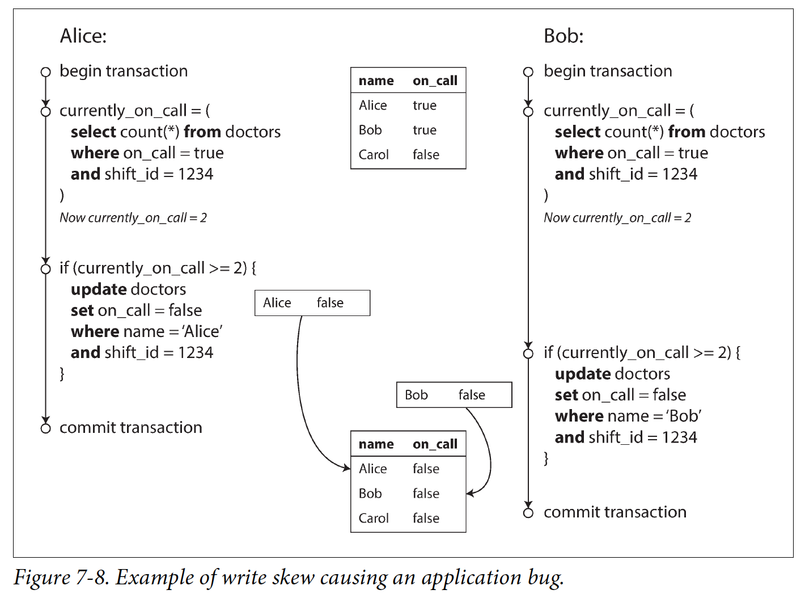

# The Slippery Concept of a Transaction

## The Meaning of ACID

### Atomicity
很熟悉了，无须过多解释
### Consistency
这个词有点被滥用了，在很多场景意思都不同，书中举例了四种场景

在ACID中，consistency含义是，在应用层面有一些不变量，一定要保持其状态不变

因为是应用层面的概念，所以需要在应用代码逻辑中保证。   如果应用里写入DB打破invariant的数据 ，DB也无能为力
> Thus, the letter C doesn’t really belong in ACID.
### Isolation
并发场景（race condition）的概念。

经典教材也会把isolation称为 _serializability_，即每个transaction都可以假定他们是唯一正在运行的transaction，不会被其他transaction影响

实际应用中，极少有DB实现完全的isolation，因为对DB性能影响很大

### Durability
含义：不丢数据

- single node DB：保存到了disk or SSD（相对稳定的存储介质）。以及，存有write ahead log
- replicated DB：`data has been successfully copied to some number of nodes`。transaction需要在replication完成后才commit

不存在完美的durability。 比如极端情况下，所有的存储介质都挂了，且不可恢复

## Single-Object and Multi-Object Operations

### Single-obejct writes
single object(这里的object指row, document, record等DB逻辑对象)的操作也是需要atomicity和isolation的，否则会遇到以下情况
- 较大的object write了一半网络断了
- overwrite遇到了断电。保持已经overwrite的一部分object，还是roll back old object？
- 并发场景，write没执行完的时候，read是否能读到中间态的write新数据？

### The need for multi-object transactions

Do we need multi-object transactions at all? 只有single object的transaction保障够吗？或许一些简单的场景是ok的，但是以下例子表明了multi-obejct transaction的必要性

- foreign key in relational DB
- vertex - edge - vertex in Graph DB
- 文档型数据库，因为缺乏join功能，促进了denormalization（In computing, denormalization is the process of attempting to optimize the read performance of a database by adding redundant data or by grouping data）的使用。有了denormalized data，原数据和denormalized data就必要一起更新
- secondary index，需要和源数据、primary index一起更新

### Handling errors and aborts

一些未实现transaction的DB（比如使用了leaderless replication类型的DB），无法在error的时候自动回滚。 需要应用层自己处理

一些ORM框架（Rails’s ActiveRecord and Django）在transaction abort后，未实现自动retry的能力

但即使做了retry，一些情况下仍然无法最终达到效果。列举如下：
- 网络失败，导致trasaction实际成功但是client认为失败，发起不必要的retry。可能导致数据重复
- 如果error源于服务过载，继续重试只会让情况更糟。  需要控制重试的次数（比如使用exponential backoff算法），或者将overload导致的失败和其他类型的失败区分开，区分处理
- 短暂的error，重试或许可以成功。 但是由于一些明确逻辑原因的失败，再重试也是失败
- 事务中有外部调用，无法回滚，事务实际无法保障。需要使用two-phase commit，核心是外部调用也能支持rollback

# Weak Isolation Levels

isolation有较大的performance损失，很多DB选择放弃一部分isolation，换取performance

weak isolation会造成bug不只是停留在理论上。现实中发生过造成重大金钱损失，或者招致金融审查的案例

即使一些流行的relational DB，实际也用的是weak isolation。未实现完全的ACID

所以，了解DB的weak isolation的细节，并在实践中结合场景做选择，是很有必要的。 这对开发者提出了更高的要求，而不是完全依赖DB

## Read Committed

>Read committed is a very popular isolation level. It is the default setting in Oracle 11g, PostgreSQL, SQL Server 2012, MemSQL, and many other databases.

 _read commited_ 是transaction isolation的最基础level。即：
- read到的都是committed的数据(no dirty reads)
- write覆盖的也都是committed的数据(no dirty writes)

### No dirty reads(脏读)

write视角：no dirty reads意味着任意writes只有在其所属的transaction committed或者roll back完成后，write带来的变更才对其他reads visibale  
read视角：read拿到的数据都是committed或者roll back完成的终态数据，不存在脏读


### No dirty writes
和No dirty reads理解类似。

### Implementing read committed

**solutions for dirty write**  
use row-level write locks, 一个transaction在write的时候，需要先拿到**排他写锁**，直到committed或者roll back后，才释放该lock。按照No dirty write的定义，这里的lock是在write开始时获取，在transaction完成时释放

但是row-level write locks无法完全避免`race condition`。比如7-1图的counter increment场景(图中每个user的前后read和write，并未合并为一个transaction)，后一个transaction在前一个committed后才write，read的也是committed的数据，做到了read commited，但仍然得到错误的结果。  **这里有个疑问，如果有这个race condition的问题，为啥很多流行数据库的default isolation level是read committed？**


**solutions for dirty read**  
- lock: 使用same row-level lock，read时申请lock，read完成后立即释放lock，有write lock的时候read就阻塞。  但是这种方式在write比较慢的情况下，read performance会受到很大影响
- copy: DB remembers both the old committed value and the new value(just two version), write没有commited的时候read old version；commited后read new version

## Snapshot Isolation and Repeatable Read

read committed导致 _read skew_（aka _nonrepeatable read_） 现象


Account1/2都是Alice的账户，一共1000元，她操作从Account2向Account1转账100元。        Alice读两个account是同时发起的（transaction），但是由于同时有两个write，虽然满足read committed，但是刚好Alice看到的两个账户结果加起来不等于100

核心问题是，两个write虽然保证了顺序执行，但是没有成为一整个transaction

这种暂时性的非一致性，在下面两种场景下不可接受：
- 数据库backup执行时间长，要backup很多数据。不能backup里既有new version，也有old version。 backup内，预期是同时保持new version，或者同时保持old version
- OLAP。大数据分析场景，query执行复杂且慢，不能一部分读old version，一部分读到new version

_snapshot isolation_ 是针对这类场景的最常用解法，snapshot可以看作多个committed transaction的集合，其中不存在未committed的数据
> it is supported by PostgreSQL, MySQL with the InnoDB storage engine, Oracle, SQL Server, and others


### Implementing snapshot isolation

snapshot isolation也是使用write locks来避免dirty writes。但是这个lock只block其他write，不阻碍read。同样read也不阻碍write
> a key principle of snapshot isolation is readers never block writers, and writers never block readers.

read committed通过write lock，只实现了单个write的ACID。 

snapshot isolation可以在read不阻塞的前提下，解决 _read skew_ 现象。这种技术也被称为 _multiversion concurrency control (MVCC)_

snapshot也可以用来实现read committed。不同之处在于，read committed只包含单个write； 而snapshot isolation用于整个transaction，可能包含一系列读写操作

具体实现上，snapshot isolation会在每行数据上增加专门的字段用来记录transaction id。Figure 7-7给出了一个例子

- `created_by` field，记录insert这条数据的transaction id
- `deleted_by` field，记录delete这条数据的transaction id。delete为软删除，保留version。等确认没有任何transaction access这条数据的时候，由单独的GC进程执行硬删除


### Visibility rules for observing a consistent snapshot
给object打上transaction id后，如何使用这个记录来做snapshot isolation? 具体的visibility rules是怎样的？

when a transaction reading from DB，以下数据对它不可见：
1. transaction开始的时刻，仍在执行中的其他transaction update（create or delete）的数据
2. 已经aborted的transaction update
3. 那些transaction ID 晚于 current transaction的update，即使已经committed也不可见


结合Figure 7-7，因为`txid=13`是在`txid=12`之后开始的，所以即使`txid=13`已经committed了, `txid=12`最后read到的account2的值仍是old value 500


### Indexes and snapshot isolation
在这种使用multi-version snapshot的DB中，indexes如何正常工作？

一种方案是:  
- 对于multi-version objects: index维护对所有version object的索引，同时在查询的时候，使用index query过滤掉那些不应该被当前transaction看到的object
- 对于deleted object versions: 如果GC删除了某个old version object, 应该同时删除其index信息

另一种在CouchDB, Datomic, and LMDB中使用的方案是:  
对index也使用copy-on-write, update object的时候，受影响的index page以及其直到root的所有parent pages，copy出新的版本。 当然，也需要background process做compaction和GC

### Repeatable read and naming confusion
snapshot isolation在SQL标准中没有明确定义，因为这份标准基于1975年System R对isolation level的定义，当时snapshot isolation尚未被发明。

SQL标准倒是定义了repeatable read, 但是它有两个问题。一是它和snapshot isolation并不完全相同，二是它其定义本身也有很多歧义、不准确的地方。 导致的结果是，即使有些DB声称实现了repeatable read，但实际上并没有达到真正的repeatable read（有其他研究给出了更完备的定义），同时已经几乎没有人真的了解什么是真正的repeatable read
>In Oracle it is called serializable, and in PostgreSQL and MySQL it is called repeatable read

## Preventing Lost Updates
主要讨论并发写可能的带来的update丢失问题（known as `lost update problem`），尤其是多个application层面的`read-modify-write cycle`同时操作一个object(例如counter, document, wiki page)

### Atomic write operations
一般DB都自带了atomic operations，通过exclusive lock实现原子性。能用则用，避免application层面自己实现`read-modify-write cycle`导致的lost update problem

But, atomic operations不是万能的，比如concurrently 写wiki page，就无法用简单的atomic operations来解决

同时，ORM使得用户很容易在application层面自己做`read-modify-write cycle`，稍不留神，就导致lost update problem

### Explicit locking
第二种办法是application层面显式加锁，处理一些atomic operations无法解决的复杂场景

### Automatically detecting lost updates
第三种解法是，由DB engine来自动检测lost updates, 然后retry那些受影响的transaction。这个feature可以很高效地和snapshot isolation结合起来实现

> PostgreSQL’s repeatable read, Oracle’s serializable, and SQL Server’s snapshot isolation levels automatically detect when a lost update has occurred and abort the offending transaction. However, MySQL InnoDB’s repeatable read does not detect lost updates.

### Compare-and-set
如果DB没有transaction功能，但是可能提供了一种atomic compare-and-set operation，原理是在`read-modify-write cycle`中，write时object的value需要和read时（old value）保持一致，才执行write，否则中止。

但是，如果DB提供了snapshot isolation，write时读到的old value是snapshot版本，并不能反映obeject的真实值。 等write真正执行时，obejct的value可能已经被更新了。 所以在使用DB的compare-and-set功能之前，一定要搞清楚它是否concurrently safe。


## Write Skew and Phantoms
concurrent writes的情况下，不只会出现dirty wirtes和lost update这两种race condition。下图举出了另一种情况，被称为`write skew`。doctors oncall shift需要同时至少有1位医生oncall，但是下图这种情况导致2位医生都off duty


### Characterizing write skew
write skew和lost update的不同之处在于，concurrent transactions write **different objects**。atomic operations和snapshot isolation对此无能为力，因为这两种方法都是针对concurrent write同一个object的情况

configurable constraints和explicit lock（explicitly lock the rows that the transaction depends on）可以解决一部分write skew场景

最完备的解法是真正实现serializable isolation，完全意义上的isolation

### More examples of write skew
write skew并不是一种罕见的情况，书里在这一小节举出了更多write skew的例子

### Phantoms causing write skew
结合前述的介绍，可以抽象总结出导致write skew的具体condition

1. concurrent transactions 执行select query，读取统计数据
2. 基于select到的数据，application层面判定requirement condition是否满足。如果满足，继续执行3
3. 执行write（insert, delete, update） ，执行结果会直接改变1中query查询到的数据。这里尤其关注insert new objects的场景，这也是lock或者snapshot isolation不灵光的原因。object之前尚不存在，没有可加锁或者可snapshot的对象

这里可以引出`Phantom`的定义
>This effect, where a write in one transaction changes the result of a search query in another transaction, is called a phantom

### Materializing conflicts
这里提出了一种workaround。没有object可以加锁，那就预先造出来这些对象，然后给这些对象加锁。这种方法被称为`materializing conflicts`

比如meeting room的场景，可以先把time slots预先create出来。 

但是，这种方法只是没有办法的办法，过于复杂。以及：
> it’s ugly to let a concurrency control mechanism leak into the application data model

A serializable isolation level是理想的方案

# Serializability
想要理解为什么serializable isolation是困难的，可以先从如何实现serializable isolation入手

## Actual Serial Execution
serializability是一种显而易见的规避concurrent问题的方式：顺序地、单线程地一次执行一个transaction。既然这么显而易见，为什么DB设计者们花了30年追求performance后，突然又觉得serializability这条路可行了呢？主要原因有二
1. RAM越来越便宜，transaction执行过程可以都在memory中完成，无需和disk交互。使得执行速度大大加快，顺序执行的latency变得可接受
2. 大家发现，OLTP的transactions大多都short and small。 OLAP的query相比之下大很大，但是基本都是read-only，可以通过snapshot isolation解决

### Encapsulating transactions in stored procedures
传统DB的transaction支持interactive with application code, 甚至user input，这使得DB要花很多时间等待input（包括network cost）。single-threaded DB的transaction对这一点做了限制，一个transaction必须一次性提交到DB执行，中间不允许和application及以上层交互。这样节省了network消耗，数据也可以一次性加载到memory，省掉了disk IO，使得transaction可以更快的完成执行


### Pros and cons of stored procedures

cons:
1. 每种DB都有自己的支持stored procedures的语言，但是并没有随着编程语言的演进而改进
2. stored procedures不好做开发生命周期的管理：version control, debug, tests, CI/CD, metrics collection
3. DB通常是performance-sensitive，因为一台DB的instance要服务多台server instance。因此，一段badly written的stored procedure会造成比application code大得多的影响

solutions:
1. 一些DB开始使用general编程语言来实现stored procedure。`VoltDB uses Java or Groovy, Datomic uses Java or Clojure, and Redis uses Lua`

### Partitioning
serializability带来的问题是，DB的write吞吐量大大降低。如何scale up throughput？有一个影响很大的因素是数据的partition。如果可以做到一个stored procedure只需要读写一个partition上的数据，那throughtput就可以通过增加CPU core来scale up，每个core服务一个thread，这个thread只特定服务于一个partition

如果无法实现这种划分，就需要额外的coordination来协调多个partition的lock，大大降低throughtput。

## Two-Phase Locking(2PL)

- 2PL: readers block writers, and writers block readers
- isolation snapshot: readers never block writers, and writers never block readers


### Implementation of two-phase locking
The lock can either be in shared mode or in exclusive mode:
- shared mode: for reads. Several reads can hold the lock in shared mode simultaneously.
- exclusive mode: for writes.  

1. Shared mode and exlusive mode block exclusive mode; Exclusive mode block shared mode.
2. After a transaction has acquired the lock, it must continue to hold the lock until the end of the transaction. Phase1 is locks are acquired, phase2 is locks are released.

### Performance of two-phase locking
显而易见，2PL性能很差。尤其是当有一个transaction access了很多object，并且执行很慢的时候，有可能拖垮整个DB

### Predicate locks
加在condition(如下面的SQL，where语句后的就是condition)上的lock，当read or write命中同样的condition时，需要按照类似2PL lock(shared mode and exclusive mode)来block

```sql
SELECT * FROM bookings
WHERE room_id = 123 AND
end_time > '2018-01-01 12:00' AND
start_time < '2018-01-01 13:00';
```
2PL如果包含predicate locks, 可以实现完全的serializable
>If two-phase locking includes predicate locks, the database prevents all forms of write skew and other race conditions, and so its isolation becomes serializable.

### Index-raneg locks
predicate locks的要花时间match基于各种condition的locks，性能是很差的。

有一种简化方案，扩大原本condition到整个index。 比如：原本是booking meeting roomid 1, 2 and 3, 扩大lock对象到整个roomid index。 好处是足够简单，并且index加速了read, write的速度

## Serializable Snapshot Isolation(SSI)


